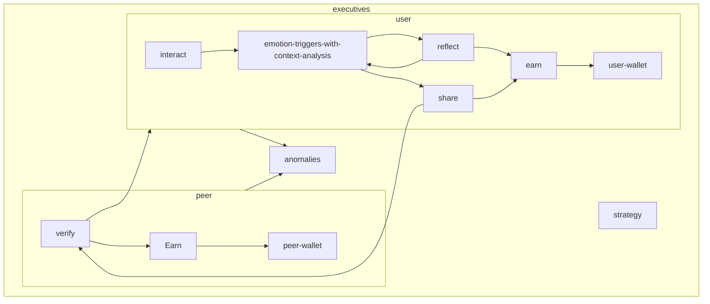

# interact, reflect, improve empathy, earn rewards for contribution towards customer-intimacy network exchange  

```mermaid
graph TD;
  subgraph executives
    strategy 
    user & peer --> anomalies 
    end
  subgraph user
    interact --> emotion-triggers-with-context-analysis --> reflect & share --> earn --> user-wallet
    reflect --> emotion-triggers-with-context-analysis
    end
  subgraph peer
    share --> verify --> user & Earn
    Earn --> peer-wallet
    end
```
