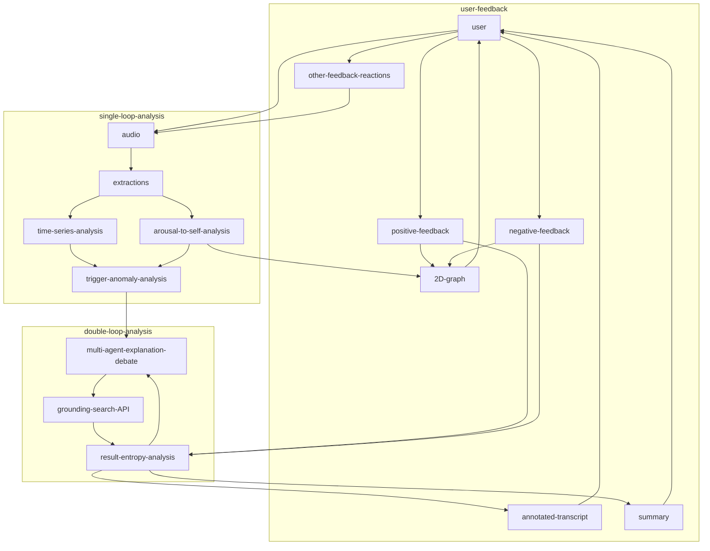

# discover latent emotion triggers in sales audio recordings & reason about possibilities at each point 

```mermaid
graph TD;
  user --> audio
  subgraph single-loop-analysis
    audio --> extractions --> time-series-analysis & arousal-to-self-analysis --> trigger-anomaly-analysis
    end
  subgraph double-loop-analysis
    trigger-anomaly-analysis --> multi-agent-explanation-debate --> grounding-search-API --> result-entropy-analysis --> multi-agent-explanation-debate
    end
  subgraph user-feedback
    annotated-transcript & summary --> user
    result-entropy-analysis --> annotated-transcript & summary
    arousal-to-self-analysis --> 2D-graph --> user --> positive-feedback & negative-feedback & other-feedback-reactions
    other-feedback-reactions --> audio
    positive-feedback & negative-feedback --> result-entropy-analysis & 2D-graph
    end 
```
