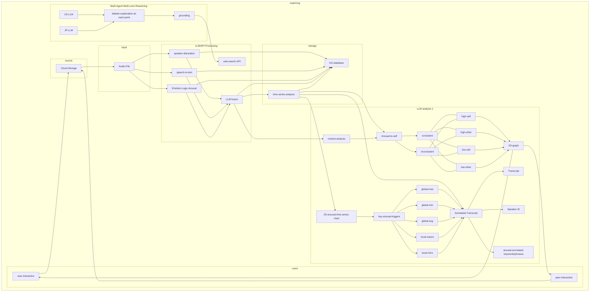

# discover latent emotion triggers in sales audio recordings

```mermaid
graph TD;
subgraph supercog
	subgraph users
		user-interaction
		peer-interaction
		end
	subgraph source
		user-interaction & peer-interaction --> Cloud-Storage
		end
	subgraph input
		Cloud-Storage --> Audio-File
		end
  	subgraph LLM/API Processing
  		Audio-File --> speaker-diarization & speech-to-text & Emotion-Logic-Arousal --> LLM-fusion
		web-search-API
  		end
  	subgraph storage
    		speaker-diarization & speech-to-text & Emotion-Logic-Arousal --> KG-database
  		LLM-fusion & time-series-analysis --> KG-database
  		end
  	subgraph LLM analysis 1 
		LLM-fusion --> time-series-analysis & context-analysis --> Arousal-to-self --> consistent & inconsistent
		consistent & inconsistent --- high-self & high-other & low-self & low-other --> 2D-graph
		time-series-analysis --> Annotated-Transcript --> Transcript & Speaker-ID & arousal-annotated-keywords/phrases
  		time-series-analysis --> 2D-arousal-time-series-chart --> key-arousal-triggers --> global-max & global-min & global-avg --> Annotated-Transcript
		key-arousal-triggers --> local-maxes & local-mins --> Annotated-Transcript
		2D-graph --> user-interaction & peer-interaction
		end
	subgraph Multi-Agent Multi-Lens Reasoning
		US-LLM & JP-LLM --> debate-explanation-at-each-point --> grounding --> web-search-API
		end
		 
end

```
