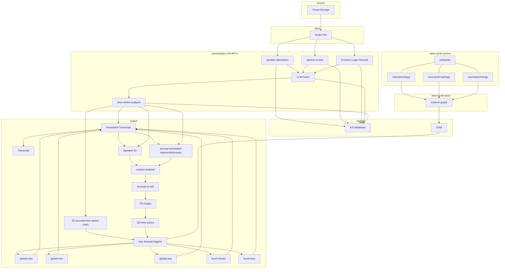

```mermaid
graph TD;
  subgraph source
	Cloud-Storage
  end
  subgraph slow-cycle-source
  wikipedia --- neurosociology & neuroanthropology & neuropsychology
  end 
	subgraph input
	Cloud-Storage --> Audio-File
	end
  subgraph slow-cycle-input
  neurosociology & neuroanthropology & neuropsychology --> science-graph
  end
  subgraph processing-LLM-API's
  Audio-File --> speaker-diarization & speech-to-text & Emotion-Logic-Arousal --> LLM-fusion --> time-series-analysis
  end
  subgraph storage
    speaker-diarization & speech-to-text & Emotion-Logic-Arousal --> KG-database
    LLM-fusion & time-series-analysis --> KG-database
    science-graph --> GAM
   end
  subgraph output
  time-series-analysis --> Annotated-Transcript --> Transcript & Speaker-ID & arousal-annotated-keywords/phrases
  time-series-analysis --> 2D-arousal-time-series-chart --> key-arousal-triggers --> global-max & global-min & global-avg --> Annotated-Transcript
  key-arousal-triggers --> local-maxes & local-mins --> Annotated-Transcript
  time-series-analysis --> Speaker-ID & arousal-annotated-keywords/phrases --> context-analysis --> Arousal-to-self --> 2D-Graph --> 3D-time-series --> key-arousal-triggers
  GAM --- key-arousal-triggers
end
```
