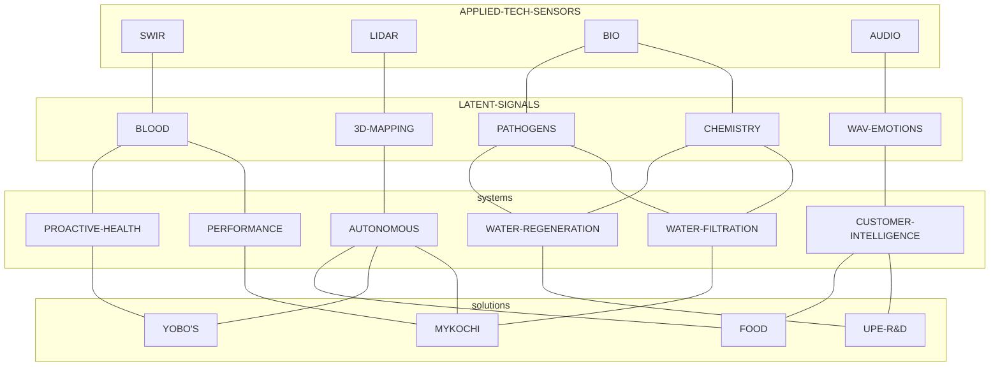

```mermaid
graph TD;
	subgraph APPLIED-TECH-SENSORS
	SWIR 
	LIDAR 
	BIO  
	AUDIO 
	end
	subgraph LATENT-SIGNALS
	SWIR --- BLOOD
	LIDAR --- 3D-MAPPING
	BIO --- PATHOGENS & CHEMISTRY
	AUDIO --- WAV-EMOTIONS 
	end
	subgraph systems
	WAV-EMOTIONS --- CUSTOMER-INTELLIGENCE
	PATHOGENS & CHEMISTRY --- WATER-REGENERATION & WATER-FILTRATION 
	3D-MAPPING --- AUTONOMOUS
	BLOOD --- PROACTIVE-HEALTH & PERFORMANCE 
	end
	subgraph solutions
	CUSTOMER-INTELLIGENCE & AUTONOMOUS --- FOOD
	CUSTOMER-INTELLIGENCE & WATER-REGENERATION --- UPE-R&D
	PROACTIVE-HEALTH & AUTONOMOUS ---  YOBO'S  
	PERFORMANCE & AUTONOMOUS & WATER-FILTRATION --- MYKOCHI
	end
	
```
