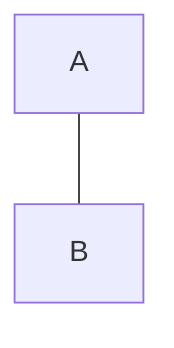
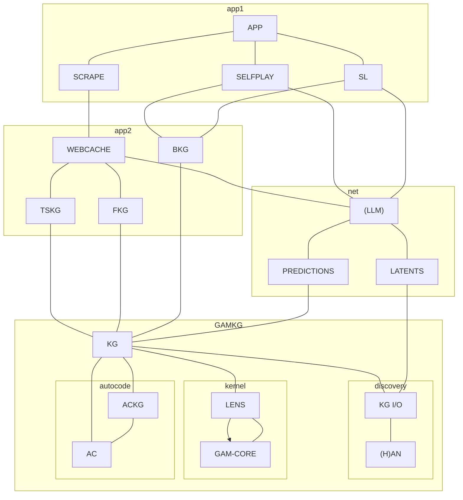

```mermaid
graph TD;
	A --- B
```

```mermaid
graph TD;
	subgraph app1
	APP --- SCRAPE
	APP --- SELFPLAY & SL
	end
	subgraph app2
	SCRAPE --- WEBCACHE --- TSKG & FKG
	SELFPLAY & SL --- BKG
	end
	TSKG & FKG & BKG --- KG
	WEBCACHE & SELFPLAY & SL --- LLM["(LLM)"]
	KG --- LENS & KGIO["KG I/O"] & AC
	subgraph net 
	LLM --- PREDICTIONS & LATENTS
	end
	LATENTS --- KGIO
	PREDICTIONS --- KG
	subgraph GAMKG
	KG --- ACKG
	subgraph discovery
	KGIO --- HAN["(H)AN"]
	end
	subgraph kernel
	LENS  --> GAM["GAM-CORE"]
	LENS --- GAM
	end
	subgraph autocode
	ACKG --- AC
	end
	end
```
